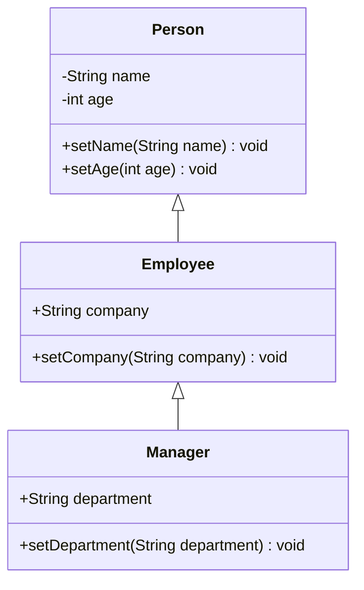
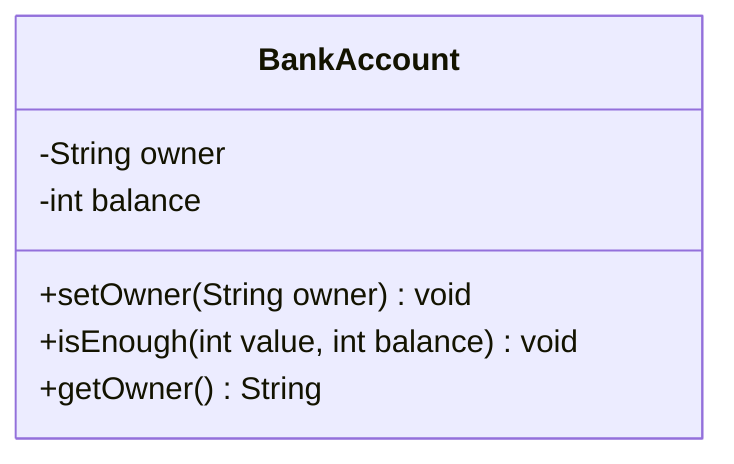
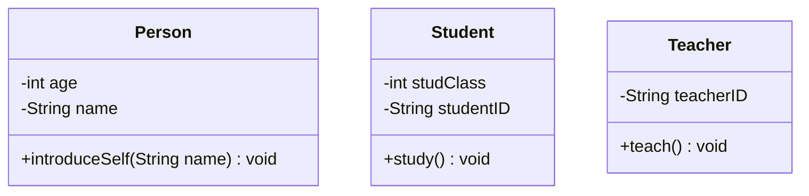
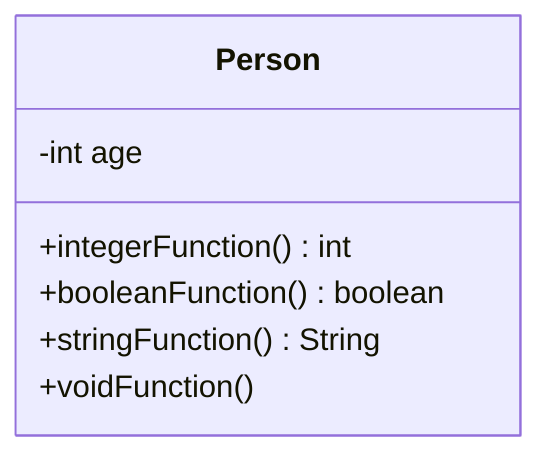
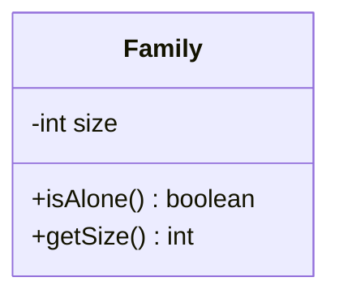
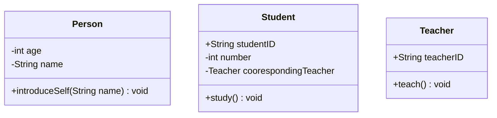

# PD2 Homework 2


Generated by DALL.E

<aside>
🔥 Announcement:

- Deadline - 2024/4/3 (Wed.) 23:59
- 相關測資置於server的/home/share/hw2，請透過
`cp /home/share/hw2/validate_hw2.py ~/hw2` 
將python檔案copy到與你的`CodeGenerator.java` 同一個位置
- 請確認你的`CodeGenerator.java`放在`~/hw2/CodeGenerator.java`。作業1我們是以扣分處理沒有正確放置的情況，作業2將直接以找不到`~/hw2/CodeGenerator.java`，不執行 - 0分計算。
    
    Please make sure your `CodeGenerator.java` is located in `~/hw2/CodeGenerator.java`. In Homework 1, we deducted points for files not correctly placed. For Homework 2, if the file cannot be found in `~/hw2/CodeGenerator.java`, it will not be executed - 0 points will be given.
    
- Server作業繳交Guideline 請見:
‣
</aside>

<aside>
🔥 HW2的相關釋疑：

- 可以使用regex功能
- 如果是get/set開頭的function，一定會有對應的attribute可以做assignment或取值。不會有例外情況需考慮。
</aside>

# Code Generator for Mermaid Class Diagram

# Introduction to Mermaid

Mermaid 是一種基於標記式文本資料(Markup Language)的圖表生成工具，允許使用者透過簡單的文本語言來創建和維護圖表。這意味著用戶可以用類似 Markdown 的語法快速繪製流程圖、序列圖、甘特圖等多種圖表，而無需使用複雜的圖形編輯軟件。Mermaid 的目的是簡化圖表的創建過程，讓開發者和技術人員更容易地在文檔中包含複雜的圖表。

<aside>
🔥 Mermaid is a JavaScript based diagramming and charting tool that renders Markdown-inspired text definitions to create and modify diagrams dynamically.

</aside>

[About Mermaid | Mermaid](https://mermaid.js.org/intro/)

其中，Mermaid Class Diagram是一種用於創建class呈現的結構圖的工具。它用於代表類別的關係以及它們如何相互交互。Mermaid Class Diagram提供一種簡單和直觀的方式來做到類似UML的class diagram的概念呈現，只需使用一種Markdown-based語言即可創建出清晰且易於理解的class relation。

Mermaid Class Diagram is a tool for creating structured diagrams for class presentations. It is used to represent the relationships between classes and how they interact with each other. Mermaid Class Diagram provides a simple and intuitive way to present concepts similar to UML class diagrams, just by using a Markdown-based language to create clear and easy-to-understand class relations.

## Example of Mermaid Class Diagram

以下是一個Mermaid class diagram的例子，其中包含三個類別：Person，Employee和Manager。每個類別都有其屬性資料和方法。



以下是這個class diagram對應的Java程式碼：

```java
public class Person {
    private String name;
    private int age;
    public void setName(String name) {
        this.name = name;
    }
    public void setAge(int age) {
        this.age = age;
    }
}
public class Employee extends Person {
    private String company;
    public void setCompany(String company) {
        this.company = company;
    }
}

public class Manager extends Employee {
    private String department;
    public void setDepartment(String department) {
        this.department = department;
    }
}

```

## Homework Requirement

Mermaid class diagram有一種簡易的Markdown表示語法：



以及他對應的java class程式碼

```java
public class BankAccount {
    private String owner;
    private int balance;
    public void setOwner(String owner) {
			  this.owner = owner;
    }
		public void isEnough(int value, int balance) {;}
    public String getOwner() {
        return owner;
    }
}
```

### 你的目標就是要將這個簡易版的Mermaid class diagram轉為java source code：一個簡易的Code Generator

### Your goal is to convert the Mermaid class diagram into java source code: a simple Code Generator

## Mermaid Syntax Specification

每一個Mermaid Class Diagram開頭一定有 `classDiagram` 

Every Mermaid Class Diagram always starts with `classDiagram`

### 定義 class

- 使用 `class` 關鍵字，後面接著class 的名稱，例如 :  `class BankAccount`

Use the `class` keyword, followed by the name of the class, for example: `class BankAccount`

### 定義 class 成員

- 一個class 的成員有 attributes (屬性)與 methods (方法)兩種

A class has two types of members: attributes and methods.

- Mermaid 根據是否存在括號 `()` 來區分屬性和方法。帶有 `()` 的被視為函數/方法，所有其他的statement視為屬性。

Mermaid distinguishes between attributes and methods based on the presence of parentheses `()`. Those with `()` are considered functions/methods, all other statements are treated as attributes.

- 使用冒號 `:` 後跟隨成員名稱來關聯一個class的成員，適用於一次定義一個成員。例如：`BankAccount : -String owner` 代表owner這個屬性是屬於 BankAccount 的 class。

Use a colon `:` followed by the member name to associate a member with a class, suitable for defining a member at a time. For example: `BankAccount : -String owner` indicates that the owner attribute belongs to the BankAccount class.

- 使用大括號`{}`關聯class的成員，其中成員在大括號內分組。適合於一次定義多個成員。（不過此種語法只會在challenge point的題目裡出現，如果你只打算拿基礎分數，可以不用考慮這個情況）

Use braces `{}` to associate members of a class, where members are grouped within the braces. Suitable for defining multiple members at once. However, this syntax will only appear in the challenge point questions.

- `+` 表示public， `-` 表示private。

`+` means public, `-` means private.

### Methods Return Type

- return 的類型一定會接在methods的右括號`)`後面，且一定有空格(可能有多個空格)在中間。例如：`+getOwner() String` 代表 `getOwner` 的 return type 為 String。

The type of `return` will always follow the right parenthesis `)` of the methods, and there must be a space (possibly multiple spaces) in between. For example: `+getOwner() String` means the return type of `getOwner` is String.

- 如果`)`後面沒有東西，則視為return為`void`。

If there is nothing behind `)`, it is considered that the return value is `void`.

## OOP Requirement I - setter & getter

> 在 Java 中，setter 和 getter 方法的機制通常被稱為「存取器方法」和「修改器方法」，或者更通俗地說是「設置器」和「獲取器」。這種機制是OOP中的一個基本概念，用於對類別的私有屬性進行安全的access和修改。
> 

> **設置器（Setter）**：這是一種修改屬性的方法，允許外部code設定或修改類別的私有屬性值。通過這種方式，在設定屬性值之前可以進行驗證或處理，確保物件的狀態保持有效和一致。
> 

> **獲取器（Getter）**：這是一種存取屬性的方法，允許外部code獲取類別的私有屬性值。使用獲取器方法可以保護屬性值不被直接存取，同時也提供了一種方式來控制對物件內部資訊的讀取。
> 
- 當methods名稱為set開頭接著attribute名稱時，output的methods內部就一定要有修改private attribute的code，具體如下，確認有一個private的 `owner` attribute，且method名稱為`set` 加上`Owner` 。
    
    (When the method name begins with 'set' followed by the attribute name, the code inside the output methods must modify the private attribute, as shown below. Ensure there is a private `owner` attribute and the method name is `set` plus `Owner`.)
    
    ```mermaid
    classDiagram
    class BankAccount
    BankAccount : -String owner
    BankAccount : +setOwner(String owner) void
    ```
    
    則setter methods裡要有幫owner賦值的動作。
    
    (The setter methods should have actions to assign values to the owner.)
    
    ```java
    public class BankAccount {
        private String owner;
        public void setOwner(String owner) {
    			  this.owner = owner;
    		}
    }		
    ```
    
- 當methods名稱為get開頭銜接attribute名稱時，output的methods內部就一定要有回傳private attribute的code，具體如下，確認有一個private的 `owner` attribute，且method名稱為`get` 加上`Owner` 。
    
    (When the method name begins with 'get' followed by the attribute name, the output of the methods must contain code that returns the private attribute. Specifically, confirm that there is a private `owner` attribute, and the method name is `get` plus `Owner`.)
    
    ```java
    classDiagram
    class BankAccount
    BankAccount : -String owner
    BankAccount : +getOwner() String
    ```
    
    則getter methods裡要有return attribute的動作：
    
    (The getter methods should return the attribute's value:)
    
    ```java
    public class BankAccount {
        private String owner;
        public String getOwner() {
    			  return owner;
    		}
    }		
    ```
    

- 當然這兩個method還有其他延伸的應用，但本次作業只要求做出上述功能。

Of course, these two methods have other extended applications, but this homework only requires the above functions.

<aside>
🔥 由於我們的程式會follow CamelCase的風格，所以attribute的開頭都是小寫如`owner`，但method第二個英文單子都是大寫如`setOwner()`或`getOwner()`。你必須自己處理這個大小寫的情況。

Because our program will follow the CamelCase style, the beginning of attributes are all lowercase such as `owner`, but the second English word in the method is capitalized like `setOwner()` or `getOwner()`. You must handle this case situation by yourself.

</aside>

## Coding Requirements

寫出的code需要用至少包含3個class，每個class有各自的功能。如以下範例，`CodeGeneraor` 為主程式，`FileReader`與`Parser`則是兩個不同的class。

```java
public class CodeGenerator {
    public static void main(String[] args) {
        if (args.length == 0) {
            System.err.println("請輸入mermaid檔案名稱");           
        }
        else {
            // get input
            String fileName = args[0];
            String mermaidCode = "";

            FileReader mermaidCodeReader = new FileReader();
            mermaidCodeReader.read(fileName);
            temp = Parser.splitByClass(mermaidCode);
       }
    }
}
class FileReader {
    public String read(String fileName) {
				...
    }
    ...
}
class Parser {
		public static String splitByClass(String input) {
			...
		}
}
```

<aside>
🔥 這只是一個示範，不一定要用這個example code來延伸，但你的程式”至少必須包含3個class” — 這是作業要求。

This is just a demonstration, you don't necessarily have to extend from this example code, but your program "must contain at least 3 classes" - this is a homework requirement.

</aside>

## Input issues

- 每一行視為一個string，以斷行符號區別不同的string。
- 每一行string都符合Mermaid Class Diagram語法。
- 一個test file最多只會包含3個class。
- setter跟getter method一定會符合規範，如setter的參數一定只有一個，且符合attribute的name及type，return type一定為void，不需要處理exception。
- 除了Challenge point會包含兩種Mermaid 語法，一般測資都只會有 `:` 這種語法。

- Each line is considered as one string, distinguished by line breaks.
- Each line of the string follows the Mermaid Class Diagram syntax.
- A test file will contain at most 3 classes.
- Setter and getter methods will definitely conform to the standard. For example, a setter will always have only one parameter that matches the attribute's name and type, and its return type will always be void. There is no need to handle exceptions.
- Apart from the Challenge point which will include two types of Mermaid syntax, regular test data will only contain the `:` syntax.

<aside>
🔥 請注意每一行會有多餘的空白的可能性。不是只要利用單一空白符號來做為分隔不同token。

Please be aware that each line may contain extra spaces. It's not just about using a single space character to separate different tokens.

</aside>

## Compile Way

```java
javac CodeGenerator.java
```

由於你可能會寫多個不同的class(作業要求最少要有3個java class)，但我們尚未教到project管理的工具，如果不同的class都定義為`public`的話，會出現compile error。為了避免這種情況，除了主程式為`public class CodeGenerator` ，其他的class就寫為 `class ClassName` ，如此一來，只要compile CodeGenerator.java，其他的class也會自動產生其對應的class檔，而沒有compile error。

Because you may write multiple different classes (more than 3), and we have not yet taught project management tools, if different classes are defined as `public`, a compile error will occur. To avoid this situation, except for the main program as `public class CodeGenerator`, other classes are written as `class ClassName`, in this way, as long as CodeGenerator.java is compiled, other classes will automatically generate their corresponding class files, without compile error.

## Input Arguments

Only one argument for test case file name, for instance:

```bash
java CodeGenerator tc1
```

## Output issues

- Mermaid裡面每一個class都會產生一個.`java` 檔，檔案名稱與class名稱相同，如以下的範例，應該要生成`Person.java` , `Student.java` , `Teacher.java` 三個檔案。

- In Mermaid, each class will generate a **`.java`** file, with the file name being the same as the class name. In the following example, it should generate three files: **`Person.java`**, **`Student.java`**, and **`Teacher.java`**.



- 當遇到setter或getter methods時，須按照上面的範例，output出正確的method功能，也就是`this. = …`或是`return …`

- When encountering setter or getter methods, they should be outputted with the correct functionality according to the examples provided above, like `this. = …`or`return …` .

<aside>
🔥 需要嚴格遵守縮排規範，具體如下：
(Indentation must be strictly adhered to, as follows:)

</aside>

- class 定義應縮排為 0。

- The class definition should be indented at 0 spaces.

```java
class Person
```

- 左大括號 **`{`** 應該與method 或 class 在同一行，且之間有一個空格。

- The left curly brace **`{`** should be on the same line as the method or class, with one space in between.

```java
class Person {
		
}
```

- attribute變數和method的定義應縮排為 4 個空格。

- The definition of member variables and methods should be indented by 4 spaces.

```java
class Person {
		private int age;
}

```

- method內的程式碼應會縮排為 8 個空格。

- The code inside a method should be indented by 8 spaces.

```java
class Person {
		private int age;
		public int getAge() {
				return age;
		}
}
```

- 若非getter及setter的method，如果需要return 值，`int`, `String`, `boolean`的default value分別為`0`, `“”` 以及`false`需要呈現`{return default_value;}` 。否則則需要呈現 `{;}` ，且都要與method 或 class 在同一行，以下為對應的Mermaid Code以及Java class output。

- For methods that are neither getters nor setters, if a return value is required, the default values for **`int`**, **`String`**, and **`boolean`** should be **`0`**, **`""`**, and **`false`**, respectively, and should be presented as **`{return default_value;}`**. Otherwise, it should be presented as **`{;}` , and both should be on the same line as the method or class.**

範例程式：



```java
class Person {
		private int age;
		public int integerFunction() {return 0;}
		public boolean booleanFunction() {return false;}
		public String stringFunction() {return "";}
		public void voidFunction() {;}
}
```

- 每一行output的順序依照請依照Mermaid語法的宣告順序，如以下例子，`isAlone()` 最先宣告，因此output也是由他開始。

- The order of each line in the output should follow the declaration order in the Mermaid syntax. For example, as `isAlone()` is declared first in the following example, the output should start with it as well.



```java
public class Family {
    public boolean isAlone() {return false;}
    private int size;
    public int getSize() {
        return size;
    }
}
```

<aside>
📢 3/25 update: 非getter或setter的function, return的type只會有int, String, boolean三種。

</aside>

## Challenge Point

attribute及method的定義不見得會放在同一個位置，輸出時要將同樣的class成員放在一起，且需要同時處理Mermaid的兩種語法`:` 和 `{}` 。

The definitions of attributes and methods may not necessarily be located in the same place. When outputting, members of the same class should be grouped together, and it's necessary to simultaneously handle Mermaid's two syntaxes `:`and `{}`.



以下為output:

Person.java

```java
public class Person {
    public void introduceSelf(String name) {;}
    private int age;
    private String name;
}
```

Student.java

```java
public class Student {
    private String studentID;
    public void study() {;}
    private int number;
    private Teacher coorespondingTeacher;
}

```

Teacher.java

```java
public class Teacher {
    public String teacherID;
    public void teach() {;}
}
```

## Homework Ranking

- 在deadline前，一共會提供6個test cases給大家, 包含5個基本的測資，以及1個challenge point的測資，同時也將提供對應的答案。

Before the deadline, a total of 6 test cases will be provided, including 5 basic test data and 1 challenge point test data, and corresponding answers will also be provided.

- 在繳交deadline之後，我們一共會用13個test cases，也就是除了提供的測資以外，還有5個隱藏基本測資以及2個chanllenge point的隱藏測資。

After the submission deadline, we will use a total of 13 test cases, that is, in addition to the provided test data, there are 5 hidden basic test data and 2 hidden test data for challenge points.

- 你的程式必須包含至少3個class。這是基本要求。

Your program must contain at least 3 classes. This is a basic requirement.

- output的java files會透過diff程式比較，所以output格式是嚴格被要求的，沒有例外。請與測資的golden output確認是一致的。

The output Java files will be compared through a diff program, so the output format is strictly required, no exceptions. Please make sure it is consistent with the golden output of the test data.

## Homework Validation

- 測資的位置位於 `/home/share/hw2/` ，`tc0` ~ `tc4` 為一般測資，`tc5` 為challenge point，而 `ans0` ~ `ans5` 為答案資料夾，裡面含有每個測資對應的`.java`檔案。
- 於測資的地方也會提供 validate_hw2.py (/home/share/hw2/validate_hw2.py) 程式協助同學檢查自己程式於測試資料上執行的正確性。
- 作業的檔案名稱請命名為`CodeGenerator.java`
- 同學請在server將`validate_hw2.py`複製一份到~/hw2，也就是與你的`CodeGenerator.java`相同的位置。
- `python3 validate_hw2.py` 指令是用來運行所有的 testcase，裡面將您的 `CodeGenerator.java`加上測資得到輸出檔案後，使用 diff 與正確答案進行比對。
- 如果您想要分開執行testcase，可以在 `python3 validate_hw2.py` 後面加上參數 0~5。例如，執行 `python3 validate_hw2.py 0` 將會運行 tc0。
- 若沒有寫challenge point的部分，tc5的部分會無法通過，屬於正常現象。


- 對於此程式有發現任何問題，歡迎寄信到助教信箱，請勿自行修改測資，謝謝!

<aside>
🔥 切記檔案要放在`~/hw2` 底下，避免錯誤的作業繳交情況!

</aside>

<aside>
📢 3/22 update: validate_hw2.py修正執行java command錯誤。

</aside>

<aside>
📢 3/22 update: validate_hw2.py修正sdiff參數，現在每行能夠顯示120字。

</aside>

<aside>
📢 3/22 update: 修正tc5測資開頭沒有 `classDiagram` 關鍵字。

</aside>

## Tips

以下是一個Java範例，示範如何讀檔以及輸出一個新的java檔案。

Here is a Java example demonstrating how to read a file and output a new Java file.

```java
import java.io.BufferedWriter;
import java.io.File;
import java.io.FileWriter;
import java.io.IOException;

import java.nio.file.Files;
import java.nio.file.Paths;
import java.util.ArrayList;

public class CodeGenerater {
    public static void main(String[] args) {
		    // 讀取文件
        if (args.length == 0) {
            System.err.println("請輸入檔案名稱");
            return;
        }
        String fileName = args[0];
        System.out.println("File name: " + fileName);
        String mermaidCode = "";
        try {
            mermaidCode = Files.readString(Paths.get(fileName));
        }
        catch (IOException e) {
            System.err.println("無法讀取文件 " + fileName);
            e.printStackTrace();
            return;
        }
        
        
        // 寫入文件
        try {
            String output = "Example.java";
            String content = "this is going to be written into file";
            File file = new File(output);
            if (!file.exists()) {
                file.createNewFile();
            }
            try (BufferedWriter bw = new BufferedWriter(new FileWriter(file))) {
                bw.write(content);
            }
            System.out.println("Java class has been generated: " + output);
        } catch (IOException e) {
            e.printStackTrace();
        }
    }
```

以下是HashMap與ArrayList的範例:

Here is an example of HashMap and ArrayList:

```java
import java.util.*;

public class CollectionExample {
    public static void main(String[] args) {
        // 使用ArrayList儲存東西
        List<String> stringList = new ArrayList<>();
        stringList.add("Apple");
        stringList.add("Banana");
        stringList.add("Cherry");

        System.out.println("ArrayList of Strings:");
        for (String fruit : stringList) {
            System.out.println(fruit);
        }

        // 使用 HashMap 儲存key value pair
        Map<Integer, String> map = new HashMap<>();
        map.put(1, "One");
        map.put(2, "Two");
        map.put(3, "Three");
				
				// iterate全部的值
        System.out.println("\nHashMap of Integer to String:");
        for (Map.Entry<Integer, String> entry : map.entrySet()) {
            System.out.println(entry.getKey() + " -> " + entry.getValue());
        }
    }
}

```

也能夠透過HashMap同時使用List:

It's also possible to use List together with HashMap:

```java
import java.util.*;

public class SchoolSubjectsExample {
    public static void main(String[] args) {
        Map<String, List<String>> subjectsToStudents = new HashMap<>();

        // 直接新增一個arraylist
        List<String> mathStudents = new ArrayList<>();
        mathStudents.add("Alice");
        mathStudents.add("Bob");
        subjectsToStudents.put("Math", mathStudents);

        // iterate全部的值
        System.out.println("School Subjects and Student Lists:");
        for (Map.Entry<String, List<String>> entry : subjectsToStudents.entrySet()) {
            String subject = entry.getKey();
            List<String> students = entry.getValue();
            System.out.println(subject + " students: " + students);
        }

        // 向已經存在的key新增value
        if (subjectsToStudents.containsKey("Math")) {
            subjectsToStudents.get("Math").add("Eva");
        }
    }
}

```

## Reference

[https://www.mermaidflow.app/](https://www.mermaidflow.app/)

[https://mermaid.live/edit](https://mermaid.live/edit)

[Class diagrams | Mermaid](https://mermaid.js.org/syntax/classDiagram.html)
